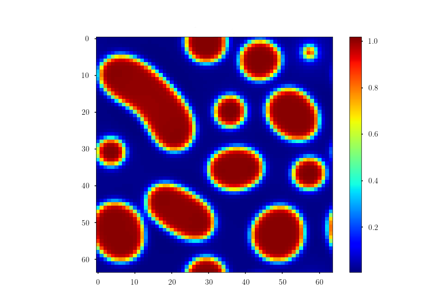

# phase_field_modeling
Python implementation of phase field model using Fourier Spectral Methods from the book [Programming Phase-Field Modeling](https://www.springer.com/gp/book/9783319411941) originally written in MATLAB.

It is shown a case study of the numerical implementation of the semi-implicit Fourier spectral algorithm for the solution of the conserved Cahn-Hilliard euation in phase-field modeling.

